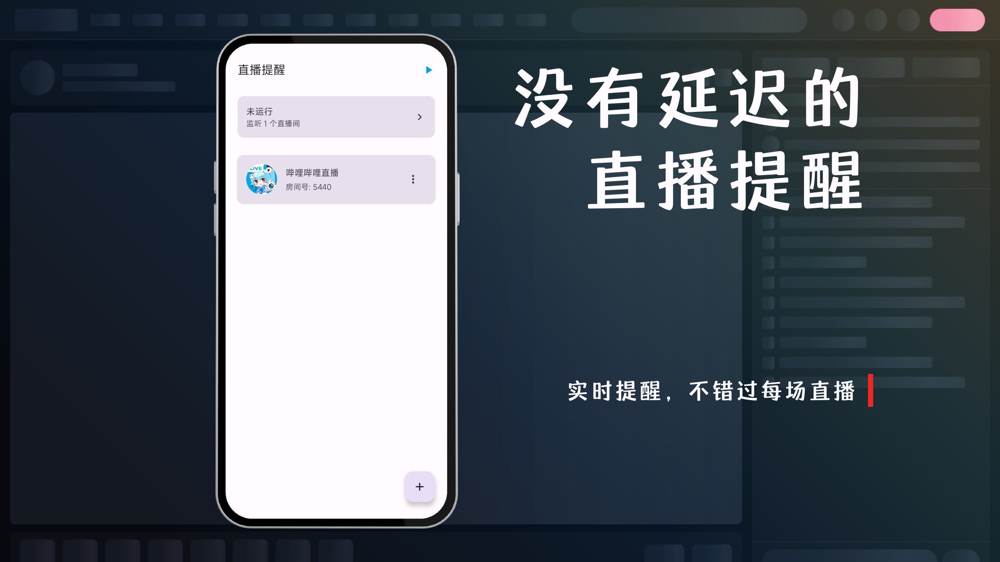
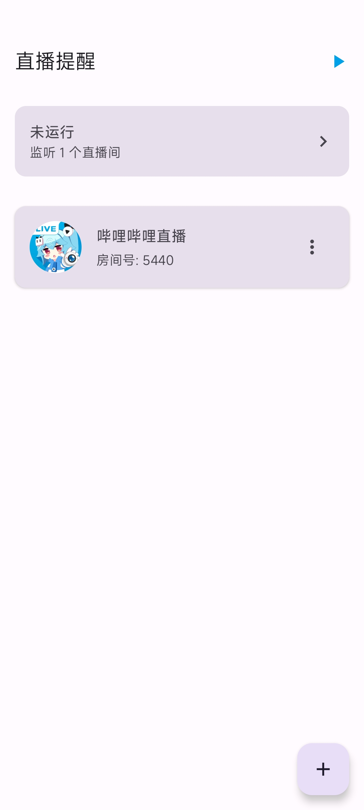
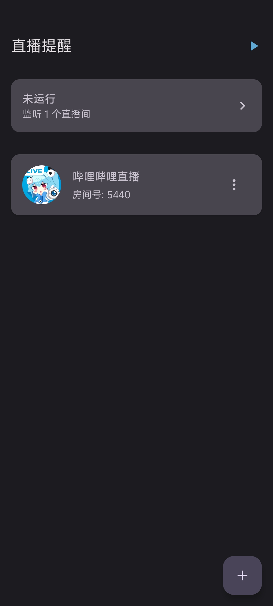
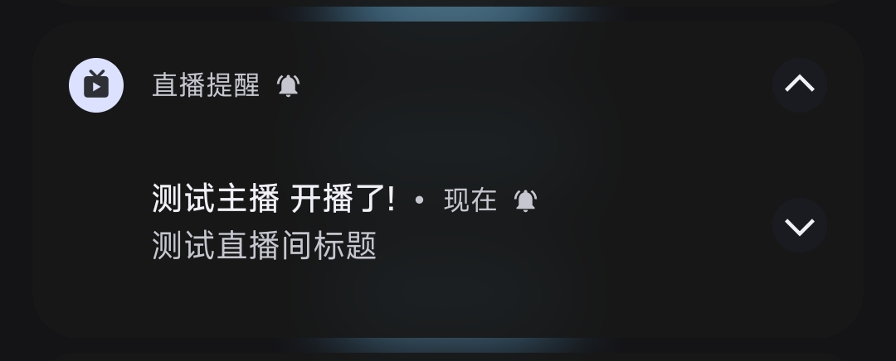
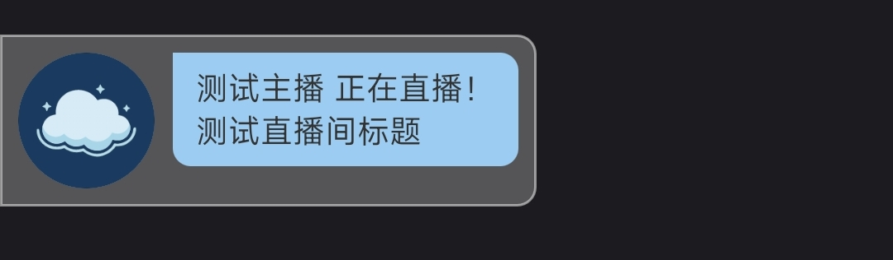

> 精心优化却以潦草收尾

> [!IMPORTANT]
>
> 可能需要知道的事：
>
> - 这是个闭源应用，此仓库仅作托管有关数据用
> - 此项目所有代码均为 LLM 生成

# 直播提醒

## 特点

- 即时提醒
- 多种通知方式
- 以及很吵的铃声
- 一些精心设计的小设计

|  |  |  |
| ------------------------------------ | ------------------------------------ | ------------------------------------ |

|      |
| -------------------------------------- |
|  |

## 疑难解答

**Q：在晚上总是断开链接？**  
A：请检查手机是否有如「夜间休眠省电」的设置，请将其关闭

**Q：开启了「铃声 + 悬浮窗」，但没有铃声？**   
A：请检查手机铃声音量是否开启，请检查是否授予悬浮窗权限（* 在当前版本中，若检测到无悬浮窗权限，则不会响铃）

**Q：悬浮窗权限经常丢失？**  
A：请前往手机设置，找到类似于「应用设置」-> 「应用管理」-> 找到本应用 -> 「权限管理」-> 「更多权限」-> 打开「后台弹出页面」与「显示悬浮窗」权限（* 以 MIUI 为例）

## 致谢

- 菲球小助手：部分功能和 UI 来源
- [SocialSisterYi/bilibili-API-collect](https://github.com/SocialSisterYi/bilibili-API-collect)：哔哩哔哩 API 参考

## 开放源代码许可

本应用使用了以下开源软件:

### Apache License 2.0

- AndroidX Libraries (Google Inc.)
- OkHttp (Square, Inc.)
- Gson (Google Inc.)
- Coil (Coil Contributors)

完整许可证文本: https://www.apache.org/licenses/LICENSE-2.0

### MIT License

- Brotli (Google Inc.)
- Reorderable (Calvin Liang)

完整许可证文本: https://opensource.org/licenses/MIT

## 下载链接

百度网盘：**TBD** 

蓝奏云：**TBD** 

